# Architecture Documentation

This document provides visual architecture diagrams and explanations for the devcontainer infrastructure.

## Container Build Hierarchy

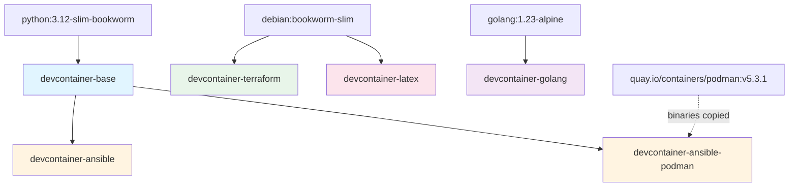

### Build Strategy

- **Base Layer** (`devcontainer-base`): Shared Python 3.12 foundation with uv and pre-commit
  - Published as: `ghcr.io/malpanez/devcontainer-base:py312`
  - Platforms: `linux/amd64`, `linux/arm64`

- **Ansible Stacks**: Extend base with Ansible tooling
  - `devcontainer-ansible`: Standard Ansible environment
  - `devcontainer-ansible-podman`: Ansible + Podman for rootless container workflows

- **Standalone Stacks**: Independent base images
  - `devcontainer-terraform`: Debian-based with HashiCorp tools
  - `devcontainer-golang`: Alpine-based Go development
  - `devcontainer-latex`: Debian-based with Tectonic engine

## Python Dependency Management Flow

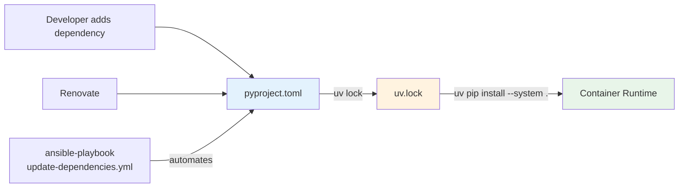

### Workflow

1. **Define dependencies** in `pyproject.toml` with version constraints
2. **Lock versions** with `uv lock` (generates `uv.lock`)
3. **Install in container** with `uv pip install --system .` during build
4. **No manual requirements.txt** - uv handles dependency resolution automatically

### Migration from requirements.txt

**Before (PR #85 and earlier):**
```bash
# Manual dependency management
uv pip install -r requirements-ansible.txt
```

**After (PR #86+):**
```bash
# Automated dependency resolution
cd /tmp && uv pip install --system .
```

Benefits:
- Single source of truth (`pyproject.toml`)
- Automatic conflict resolution
- No manual lockfile maintenance
- Standard Python packaging format

## Pre-commit Architecture

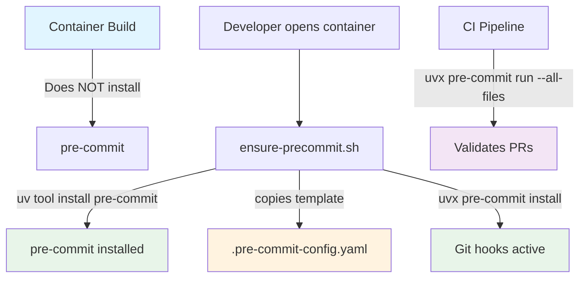

### Lazy Loading Strategy

Pre-commit is **NOT** baked into container images. Instead:

1. **Template stored** at `/usr/local/share/devcontainer-skel/<stack>/.pre-commit-config.yaml`
2. **Script provided** at `/usr/local/bin/ensure-precommit`
3. **Installed on-demand** via `uv tool install pre-commit`
4. **Always fresh** - gets latest version when installed

Benefits:
- Smaller container images (~50MB saved)
- Always up-to-date pre-commit
- Fast installs via uv
- Consistent across all stacks

## CI/CD Pipeline Flow

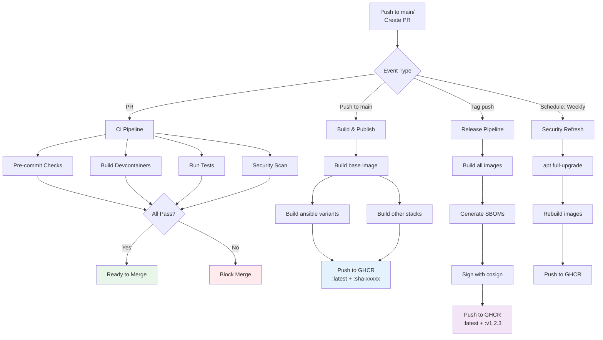

### Build Matrix

The `build-containers.yml` workflow builds:

**build-base job:**
- `devcontainer-base` (always first)

**build-all job matrix:**
- `ansible` (main Dockerfile)
- `ansible` (Dockerfile.podman variant → `ansible-podman`)
- `terraform`
- `golang`
- `latex` (amd64 only)

### Image Tags

- **On PR**: Build only, no push
- **On push to main**: `:latest` + `:sha-<commit>`
- **On tag push**: `:latest` + `:<tag>` (e.g., `:v1.2.3`)
- **Weekly schedule**: Refreshes `:latest` with security updates

## Container Variant Comparison

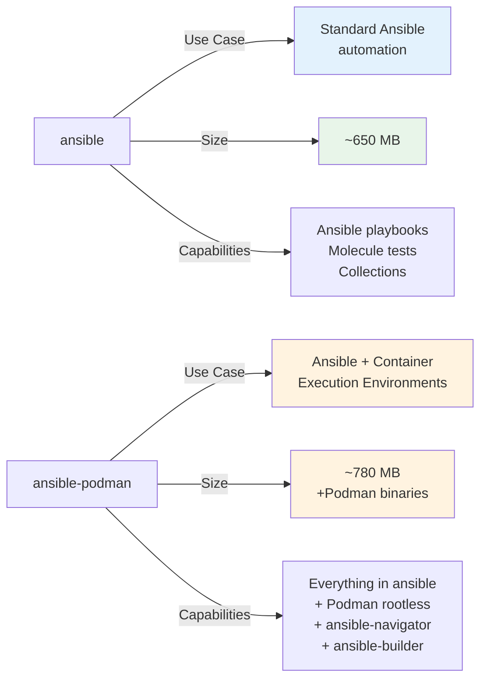

### When to Use Each

**devcontainer-ansible (standard):**
- Traditional Ansible playbook development
- Molecule testing with Docker
- Collection development
- Lighter weight

**devcontainer-ansible-podman:**
- Building Ansible Execution Environments
- Rootless container workflows
- Testing EEs with ansible-navigator
- Working with container-based automation

## Tool Version Strategy

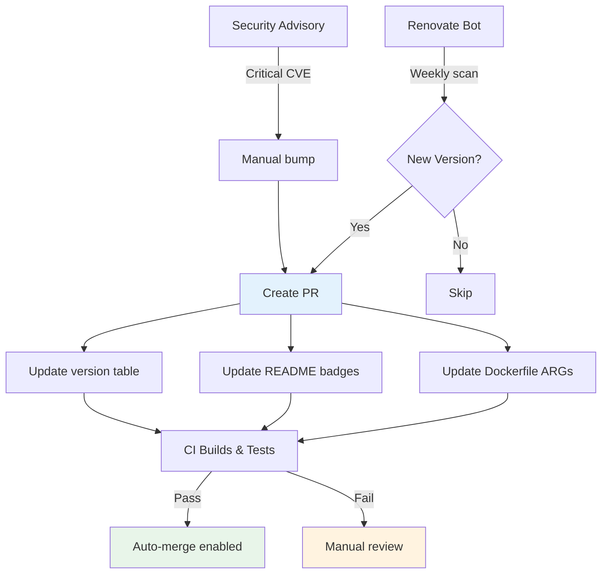

### Current Versions (as of December 2025)

| Tool | Version | Update Strategy |
|------|---------|----------------|
| Python | 3.12.12 | Patch version pinned in base image |
| Go | 1.25 | Minor version pinned, patch auto-update |
| Terraform | 1.14.0 | Patch version pinned, manual minor updates |
| Terragrunt | 0.93.11 | Minor auto-update via Renovate |
| TFLint | 0.60.0 | Minor auto-update via Renovate |
| SOPS | 3.11.0 | Minor auto-update via Renovate |
| age | 1.2.1 | Minor auto-update via Renovate |
| Tectonic | 0.15.0 | Minor auto-update via Renovate |
| Ansible | 9.14.0 | Locked via pyproject.toml + uv.lock |
| uv | 0.9.13 | Pinned in base image |
| AWS CLI | v2 (latest) | Auto-update from official installer |
| github-cli (gh) | latest | Auto-update from apt repository |
| Podman | 5.7.0 | From official Podman image |

## Security Scanning Flow

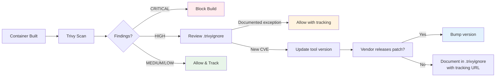

### Trivy Exception Policy

`.trivyignore` documents CVEs with:
- Affected tool and version
- CVE identifier
- Upstream tracking URL
- Justification for temporary exception
- Review date

**Example:**
```
# Terragrunt v0.93.11 - Waiting for upstream fix
# https://github.com/gruntwork-io/terragrunt/issues/XXXX
CVE-2024-XXXXX
```

## Workflow: Adding a New Dependency

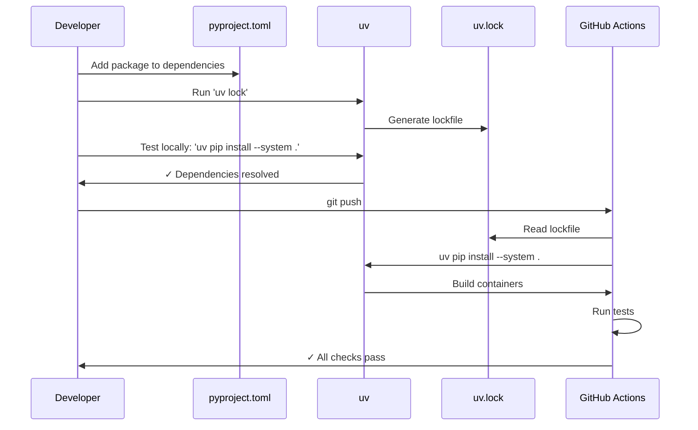

## GHCR Publishing Strategy

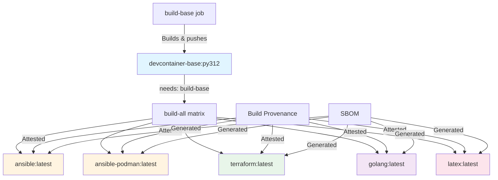

### Image Naming Convention

```
ghcr.io/malpanez/devcontainer-<stack>[variant]:<tag>
```

Examples:
- `ghcr.io/malpanez/devcontainer-base:py312`
- `ghcr.io/malpanez/devcontainer-ansible:latest`
- `ghcr.io/malpanez/devcontainer-ansible-podman:latest`
- `ghcr.io/malpanez/devcontainer-terraform:sha-5575e8d`
- `ghcr.io/malpanez/devcontainer-golang:v1.2.3`

## Stack Selection Flow

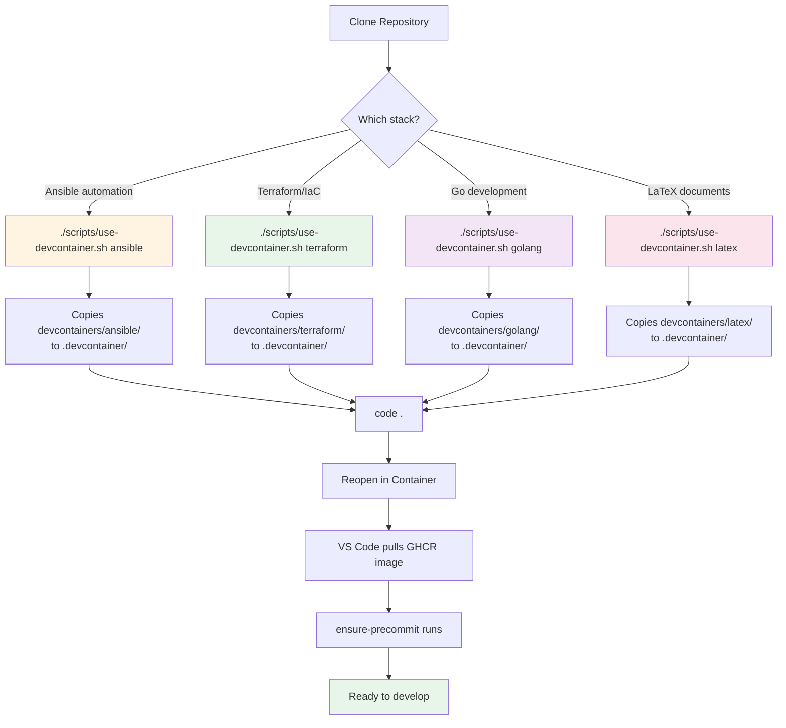

## Multi-Architecture Build

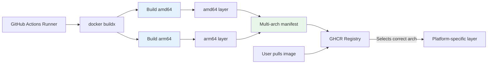

### Platform Support

| Stack | amd64 | arm64 | Notes |
|-------|-------|-------|-------|
| base | ✅ | ✅ | |
| ansible | ✅ | ✅ | |
| ansible-podman | ✅ | ✅ | |
| terraform | ✅ | ✅ | |
| golang | ✅ | ✅ | |
| latex | ✅ | ❌ | Tectonic binaries currently amd64-only |

## Summary

This architecture provides:

1. **Layered container strategy** - Shared base for Python stacks, standalone for others
2. **Modern Python packaging** - pyproject.toml + uv for fast, reproducible builds
3. **Lazy-loaded tooling** - Pre-commit installed on-demand, not baked into images
4. **Security-first CI/CD** - Trivy scanning, provenance attestation, SBOM generation
5. **Multi-arch support** - amd64 + arm64 for all stacks (except latex)
6. **Automated maintenance** - Renovate for dependencies, weekly security refreshes

For implementation details, see:
- [README.md](../README.md) - General usage and setup
- [CONTRIBUTING.md](CONTRIBUTING.md) - Development workflow
- [TROUBLESHOOTING.md](TROUBLESHOOTING.md) - Common issues
