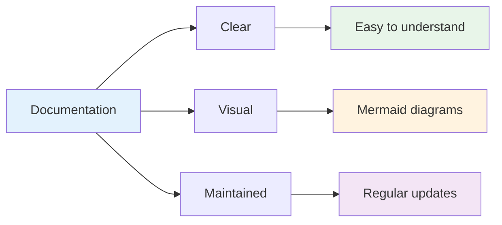

# Documentation Index

Welcome to the ansible-devcontainer-vscode documentation! This directory contains comprehensive guides, architectural documentation, and reference materials.

## 📚 Quick Start

- **[Quickstart Guide](QUICKSTART.md)** - Get started in minutes
- **[Integration Guide](INTEGRATION_GUIDE.md)** - Use devcontainers in your projects
- **[Prompts](PROMPTS.md)** - Ready-to-use prompts for AI assistants

## 🏗️ Architecture & Design

- **[Architecture](ARCHITECTURE.md)** - System architecture with Mermaid diagrams
- **[Roadmap](ROADMAP.md)** - Planned features and improvements
- **[Portfolio](PORTFOLIO.md)** - Project showcase and automation story

## 🔧 Development

- **[Contributing Guide](CONTRIBUTING.md)** - How to contribute
- **[DevContainer Debug](DEVCONTAINER_DEBUG.md)** - Troubleshooting devcontainers
- **[Maintenance Guide](MAINTENANCE.md)** - Repository maintenance procedures
- **[VS Code Workflow](VSCODE_WORKFLOW.md)** - Enhanced VS Code tasks and workflows

## 🚀 Platform-Specific

- **[Windows Bootstrap](BOOTSTRAP_WINDOWS.md)** - Windows + WSL2 setup
- **[Windows Onboarding](ONBOARDING-WINDOWS.md)** - Detailed Windows guide
- **[Corporate Networks](CORPORATE_NETWORK.md)** - VPN, proxy, and firewall setup

## 🔐 Security

- **[Security Policy](../SECURITY.md)** - Security reporting and policies
- **[Security Review](SECURITY_REVIEW.md)** - Detailed security analysis
- **[Security Alert Management](SECURITY_ALERT_MANAGEMENT_SUMMARY.md)** - Alert automation
- **[OpenSSF Scorecard Progress](OSSF_SCORECARD_PROGRESS.md)** - Security scorecard improvements
- **[Secrets Management](SECRETS.md)** - Handling credentials safely

## 🧪 Testing & Quality

- **[Branch Protection](BRANCH_PROTECTION.md)** - Branch policies
- **[Branch Cleanup Report](BRANCH_CLEANUP_REPORT.md)** - Branch maintenance
- **[Troubleshooting](TROUBLESHOOTING.md)** - Common issues and solutions

## 📋 Project Management

- **[Changelog](CHANGELOG.md)** - Release notes and changes
- **[Work Summary](WORK_SUMMARY.md)** - Recent work completed
- **[Merge Instructions](MERGE_INSTRUCTIONS.md)** - PR merge procedures
- **[Improvements Summary](IMPROVEMENTS_SUMMARY.md)** - Enhancement tracking

## 🎯 Scenarios

- **[Terraform + Proxmox](scenarios/terraform-proxmox.md)** - Homelab provisioning
- **[LaTeX Resume](scenarios/latex-cv.md)** - Document compilation

## 📊 Documentation Standards

All documentation follows these standards:

### Structure
- **H1**: Document title
- **H2**: Major sections
- **H3**: Subsections
- **Code blocks**: Language-specific highlighting
- **Mermaid diagrams**: Visual architecture/workflows

### Mermaid Diagrams

We use Mermaid for visual documentation:



### Linking
- Use relative paths: `[Architecture](ARCHITECTURE.md)`
- Link to sections: `[CI/CD](#cicd-pipeline-flow)`
- External links: Use full URLs

### Code Examples
- Include language tags: ` ```bash`, ` ```yaml`, ` ```python`
- Add comments for clarity
- Show both input and expected output

## 🤝 Contributing to Docs

1. Follow the structure above
2. Add Mermaid diagrams for complex workflows
3. Update this index when adding new docs
4. Keep docs up-to-date with code changes
5. Use descriptive filenames (lowercase, hyphens)

## 📝 Documentation Checklist

When creating new documentation:

- [ ] Clear title and purpose
- [ ] Table of contents (if >500 lines)
- [ ] Code examples with comments
- [ ] Mermaid diagrams for visual concepts
- [ ] Links to related documentation
- [ ] "Last updated" date
- [ ] Tested all commands/examples
- [ ] Added to this index

## 🔗 External Resources

- [VS Code DevContainers](https://code.visualstudio.com/docs/devcontainers/containers)
- [uv Documentation](https://github.com/astral-sh/uv)
- [Ansible Best Practices](https://docs.ansible.com/ansible/latest/tips_tricks/ansible_tips_tricks.html)
- [Terraform Best Practices](https://www.terraform-best-practices.com/)
- [OpenSSF Scorecard](https://securityscorecards.dev/)

---

**Last Updated:** 2025-12-04

For the main project README, see [README.md](../README.md)
