# VS Code Workflow Guide

This guide explains the enhanced VS Code tasks and workflows added to the project.

## Quick Access

**Access tasks**: `Ctrl+Shift+P` (Windows/Linux) or `Cmd+Shift+P` (Mac) → "Tasks: Run Task"

---

## Task Categories

### 🔄 Context Switching

Switch between devcontainer stacks instantly without leaving VS Code.


**Available Tasks:**
- `Switch Devcontainer: Ansible` - Full Ansible tooling
- `Switch Devcontainer: Terraform` - HashiCorp stack
- `Switch Devcontainer: Golang` - Go development
- `Switch Devcontainer: LaTeX` - Document processing

**Usage:**
1. Save all work
2. Run switch task
3. Reopen window when prompted
4. Container rebuilds with new stack

---

### 🧪 Testing & Quality

Run comprehensive tests and quality checks.

```mermaid
graph TD
    A[Testing Tasks] --> B[Run Pre-commit All Files]
    A --> C[Run Smoke Tests]
    A --> D[Run Terraform Tests]
    A --> E[Run Python Tests]
    A --> F[Run Ansible Tests]
    A --> G[Run Molecule Test]

    B --> H{Pre-commit}
    C --> I{Smoke}
    D --> J{Terraform}
    E --> K{Python}
    F --> L{Ansible}
    G --> M{Molecule}

    H & I & J & K & L & M --> N{All Pass?}
    N -->|Yes| O[✅ Ready to Commit]
    N -->|No| P[❌ Fix Issues]

    style O fill:#e8f5e9
    style P fill:#ffebee
```



**Available Tasks:**
- `Run Pre-commit (All Files)` - All hooks on all files
- `Run Smoke Tests` - Quick validation tests
- `Run Terraform Tests` - Format & validate
- `Run Python Tests` - pytest suite
- `Lint Ansible Playbooks` - ansible-lint
- `Test Ansible Environment` - Environment validation
- `Run Molecule Test` - Full Molecule scenario
- `Run All Quality Checks` - Combined validation

**Tip:** Use `Run All Quality Checks` before pushing to catch all issues.

---

### 🏗️ Building

Build devcontainers locally for testing.

```mermaid
graph LR
    A[Build Tasks] --> B{Select Stack}

    B -->|Single| C[Build Devcontainer: Ansible]
    B -->|Single| D[Build Devcontainer: Terraform]
    B -->|Single| E[Build Devcontainer: Golang]
    B -->|Single| F[Build Devcontainer: LaTeX]
    B -->|All| G[Build All Devcontainers]

    C --> H[docker build ansible]
    D --> I[docker build terraform]
    E --> J[docker build golang]
    F --> K[docker build latex]
    G --> L[Loop all stacks]

    H & I & J & K & L --> M[Test Image]
    M --> N{Success?}
    N -->|Yes| O[✅ Image Ready]
    N -->|No| P[❌ Check Logs]

    style O fill:#e8f5e9
    style P fill:#ffebee
```



**Available Tasks:**
- `Build Devcontainer (Ansible)` - Build Ansible stack
- `Build Devcontainer (Terraform)` - Build Terraform stack
- `Build Devcontainer (Golang)` - Build Go stack
- `Build Devcontainer (LaTeX)` - Build LaTeX stack
- `Build All Devcontainers` - Build all stacks sequentially

**Usage:**
```bash
# Builds locally without pushing to registry
# Useful for testing Dockerfile changes
```

---

### 🧹 Maintenance

Keep repository clean and up-to-date.


**Available Tasks:**
- `Cleanup Merged Branches` - Preview branch cleanup (dry-run)
- `Update Dependencies (uv lock)` - Refresh Python lockfile
- `Update Tool Versions in README` - Check version badges
- `Check Workflow Syntax` - Validate GitHub Actions
- `Lint All Dockerfiles` - hadolint validation
- `Security Scan (Trivy)` - CVE scan

**Tip:** Run `Cleanup Merged Branches` after merging PRs to keep branch list clean.

---

### 📊 Monitoring

Quick access to project metrics and status.


**Available Tasks:**
- `Check OpenSSF Scorecard` - Opens security scorecard in browser

**External Links:**
- [GitHub Actions](https://github.com/malpanez/ansible-devcontainer-vscode/actions)
- [Security Alerts](https://github.com/malpanez/ansible-devcontainer-vscode/security)
- [OpenSSF Scorecard](https://securityscorecards.dev/viewer/?uri=github.com/malpanez/ansible-devcontainer-vscode)

---

## Branch Cleanup Workflow

Automatic and manual branch cleanup process.


### Automatic Cleanup

**Trigger:** PR merged to main or develop

**Process:**
1. Workflow detects merge event
2. Extracts branch name from PR
3. Verifies branch is not protected (main/develop)
4. Deletes remote branch automatically
5. Posts summary to GitHub Actions

**Configuration:** [.github/workflows/cleanup-merged-branches.yml](.github/workflows/cleanup-merged-branches.yml)

### Manual Cleanup

**Method 1: VS Code Task**
```
Ctrl+Shift+P → "Tasks: Run Task" → "Cleanup Merged Branches"
```

**Method 2: Local Script**
```bash
# Preview (safe)
./scripts/cleanup-merged-branches.sh --dry-run

# Interactive cleanup
./scripts/cleanup-merged-branches.sh
```

**Method 3: GitHub Actions**
```
Actions → "Cleanup Merged Branches" → Run workflow → Select dry_run option
```

---

## VS Code Settings

Enhanced settings for better developer experience.


**Key Configurations:**

1. **Format on Save** - Enabled for all supported languages
2. **Git Auto-fetch** - Stay synced with remote
3. **Smart Exclusions** - Faster search performance
4. **Terraform Integration** - Language server + codelens
5. **Container Engine** - Docker by default (configurable)

**Customization:**
Edit [.vscode/settings.json](.vscode/settings.json) for project-specific overrides.

---

## EditorConfig

Cross-editor consistency for formatting.


**Configuration:** [.editorconfig](.editorconfig)

**Benefits:**
- ✅ Consistent indentation across editors
- ✅ Automatic charset/EOL handling
- ✅ Language-specific rules
- ✅ Works with VSCode, IntelliJ, Vim, etc.

---

## Keyboard Shortcuts

**Quick Reference:**

| Action | Shortcut |
|--------|----------|
| Run Task | `Ctrl+Shift+P` → "Tasks: Run Task" |
| Build | `Ctrl+Shift+B` (runs default build task) |
| Terminal | `` Ctrl+` `` |
| Command Palette | `Ctrl+Shift+P` or `F1` |
| Quick Open | `Ctrl+P` |
| Git Panel | `Ctrl+Shift+G` |

---

## Tips & Best Practices

### Before Committing
1. Run `Run Pre-commit (All Files)` task
2. Fix any reported issues
3. Verify tests pass
4. Commit with descriptive message

### Before Pushing
1. Run `Run All Quality Checks` task
2. Ensure no linting errors
3. Check for security issues
4. Push to remote

### After Merging PR
1. Update local main: `git checkout main && git pull`
2. Run `Cleanup Merged Branches` task to preview
3. Verify branch was auto-deleted by workflow
4. Clean up any remaining obsolete branches

### Switching Stacks
1. Save all open files
2. Commit or stash changes
3. Run appropriate "Switch Devcontainer" task
4. Wait for rebuild (~30s)
5. Verify new stack tools available

---

## Troubleshooting

### Task Not Found
**Issue:** Task menu doesn't show custom tasks

**Solution:**
1. Verify [.vscode/tasks.json](.vscode/tasks.json) exists
2. Reload VS Code window: `Ctrl+Shift+P` → "Developer: Reload Window"
3. Check for JSON syntax errors

### Script Permission Denied
**Issue:** Scripts fail with "Permission denied"

**Solution:**
```bash
chmod +x scripts/*.sh
```

### Devcontainer Won't Switch
**Issue:** Stack switch fails or hangs

**Solution:**
1. Close all terminal sessions
2. Save and close all files
3. Restart VS Code
4. Run switch task again

### Cleanup Script Shows No Branches
**Issue:** No branches found to clean

**Solution:**
```bash
# Update remote refs
git fetch origin --prune

# Run again
./scripts/cleanup-merged-branches.sh --dry-run
```

---

## Related Documentation

- [ARCHITECTURE.md](ARCHITECTURE.md) - System architecture with Mermaid diagrams
- [CONTRIBUTING.md](CONTRIBUTING.md) - Contribution guidelines
- [BRANCH_CLEANUP_REPORT.md](../BRANCH_CLEANUP_REPORT.md) - Branch analysis
- [README.md](../README.md) - Main project documentation

---

**Last Updated:** 2025-12-04
